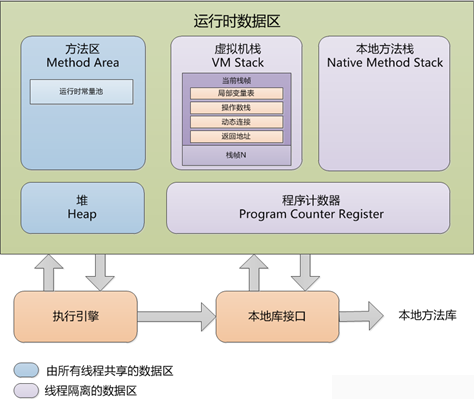

# java内存区域
#运行时数据区域
在执行Java程序时，Java虚拟机会把它所管理的内存划分为若干个不同的数据区域。**这些区域都有各自的用途，以及创建和销毁时间。**

## 程序计数器
可看做是当前线程所执行的字节码的行号指示器。通过改变这个计数器的值来选取下一条需要执行的字节码指令，分支、循环、跳转、异常处理、线程恢复等基础功能都需要依赖它来完成。
它是**线程私有的**内存区域。由于java虚拟机的多线程是通过线程轮流切换并分配处理器执行时间的方式俩实现的。在任意时刻，一个处理器都只会执行一条线程中的指令。为了线程切换后能恢复到正确的执行为主，每条线程都需要有一个独立的程序计数器，相互之间不影响，独立存储。
## Java虚拟机栈
线程私有的。是java方法在执行时的内存模型：每个方法在执行的同时会创建一个栈帧，用于存储**局部变量表、操作数栈、动态链接、方法出口**等信息。生命周期从调用该方法开始直至执行完毕。
我们经常说的“堆栈”中的栈就是指的虚拟机栈，确切的说是虚拟机栈中的局部变量表
**局部变量表**中存放了编译其可知的各种基本数据类型（long和double类型占用2个单位空间，其余的只占用1个）、对象引用和returnAddress类型（指向一条字节码指令的地址）。
局部变量表所需的内存空间在编译期间完成分配。当进入一个方法时，其所需的空间大小是完全确定的，在方法运行期间不会改变局部变量表的大小。
### 异常情况
1. 线程请求的栈深度大于虚拟机所允许的深度，将会抛出`StackOverflowError`异常
2. 虚拟机动态扩展时无法申请到足够的内存，就回抛出`OutOfMemoryError`异常。

## 本地方法栈
虚拟机栈是为执行的java方法服务，而本地方法栈则为**虚拟机使用到的native方法服务**。具体的虚拟机可以自由实现她。也会抛出sof和oom异常
## Java堆
堆是Java虚拟机所管理的内存中最大的一块，被所有线程共享，在虚拟机启动时创建。此内存区的唯一目的就是**存放对象实例**，几乎所有的对象实例都在这里分配内存。
堆是垃圾收集器管理的主要区域，因此也被称为“GC堆”。从内存回收角度看，可以将堆细分为多个区域，无论哪个区域，存储的都仍是对象实例。有关堆中的各区域分配、回收等细节，将在[下章节讲述]()
堆可以处在不连续的内存空间中，只有逻辑上是连续的即可。如果在堆中没有内存可以分配给对象实例，并且堆也无法再扩展时，将会抛出oom异常。
## 方法区
用于存储已被虚拟机**加载的类信息、常量、静态变量、动态编译后的代码**等数据。
**“永久代”**指的就是使用GC分代收集法而实现的方法区。永久代中的数据并非“永久”的存在，只是相对而言，垃圾收集行为在这个区域较少的出现。这个区域的内存回收目标主要是针对常量池的回收和对类型的卸载。
方法区可以不需要连续的内存，可以选择固定大小或可扩展，可以不实现垃圾回收，但是这部分区域的回收却是必要的。
当方法区无法满足内存分配需求时，将会抛出oom异常。
### 运行时常量池
运行时常量池是方法区的一部分。`.class`文件中除了有类的版本、字段、方法、接口等描述信息外，还有常量池。用于**存放编译器生成的各种字面量和符号引用**，在类加载后进入方法区的运行时常量池中存放。
对于运行时常量池，java虚拟机没有对其做任何细节要求，可自由实现。
它的一大重要特征是具备**动态性**，在程序运行期间也可能将新的常量放入池中。这种特性用得最多的便是`String`类的[intern()](http://www.importnew.com/12681.html)方法。
既然运行时常量池是方法区的一部分，当常量池无法再申请到内存是，会抛出oom异常。
## 直接内存
直接内存并不是虚拟机运行时数据区的一部分，也不是Java虚拟机规范中定义的内存区域。但这部分内存也被频繁的使用，也可能导致oom的出现。
在jdk1.4之后的NIO类之后，引入了一种基于通道与缓冲区的I/O方式，它可以**使用native函数库直接分配堆外内存，然后通过一个存储在Java堆中的DirectByteBuffer对象作为这个内存的引用进行操作**。从而避免了在Java堆和native堆中来回复制数据。
本机直接内存虽然不会受到java堆大小的限制，但是会受到本机总内存等诸多因素的限制。在配置虚拟机参数是，会根据实际内存设置-Xmx等参数信息，但经常忽略直接内存，使得各个内存区域总和大于屋里内存限制，从而导致动态扩展时出现oom。