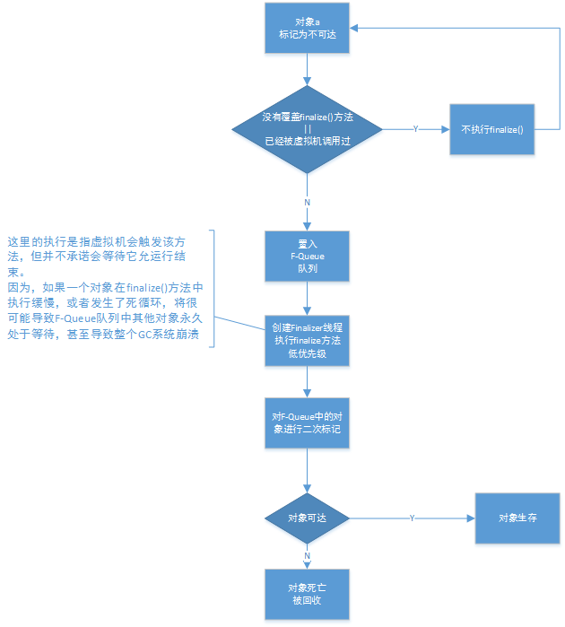
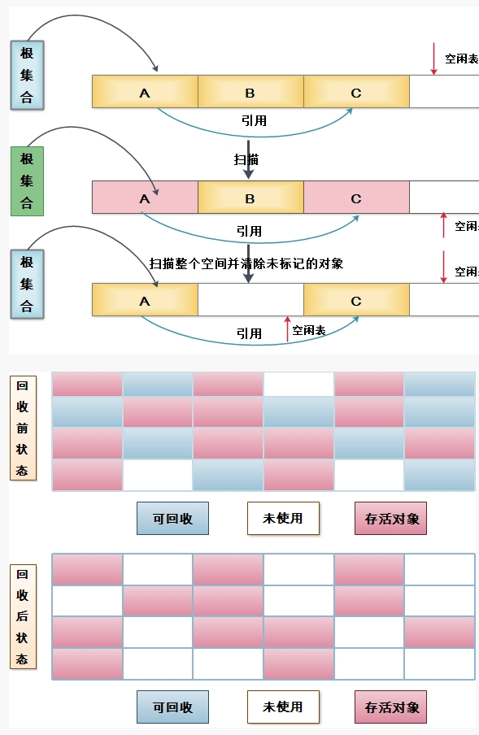
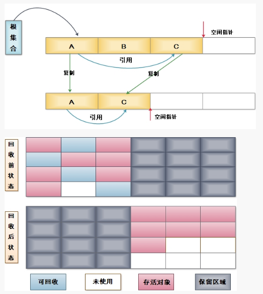
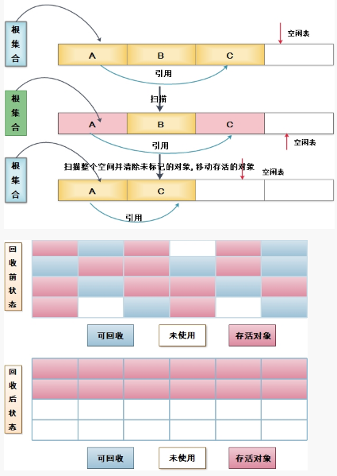

# 垃圾回收与内存分配策略
上回，我们介绍了Java内存运行时区域的各个部分，其中**程序计数器、虚拟机栈、本地方法栈3个区域随着线程而生，随着线程而灭**：栈中的栈帧随着方法的进入和退出而有条不紊地执行着出栈和入栈操作。每一个栈帧中分配多少内存基本上是在类结构确定下来时就已知晓。
因此，这几个区域的内存分配和回收都具有确定性，就不需过多的考虑回收的问题。方法或者线程结束时，内存自然就跟着回收了。
而**Java堆和方法区则不一样**，一个接口中的多个实现类需要的内存可能不一样，一个方法中的多个分支需要的内存也可能不一样。我们只有在程序处于运行期间才能知道会创建哪些对象，这部分内存的分配和回收都是动态的，垃圾收集器所关注的就是这部分内存。
## 对象的回收
在堆中，存放着几乎所有的对象实例，垃圾收集器在堆堆进行回收前，首要任务就是确定这些对象哪些还是“存活”的，哪些已经“死去”。
### 引用计数法
引用计数算法：给对象中添加一个引用计数器，每当有一个地方引用它是，计数器值+1；当引用失效时，计数器值-1；因此，任何时刻计数器为0的对象就是不可能在被使用的。
该算法的实现简单，判定效率也很高，在大部分情况下都是个不错的算法，也有一些较为著名的应用案例。但是，**主流java虚拟机内并未选用引用计数算法来管理内存**，其中最主要的原因是**它难以解决对象之间的循环引用问题。**
### 可达性分析算法
在主流的商用程序语言(java,c#等)的主流实现中，都是用此来判定对象是否存活的。此算法的基本思想就是通过一系列称为“GC ROOTS”的对象作为起始点，从这些节点开始向下搜索，搜索所走过的路径称为引用链，当一个对象到GC ROOT没有任何引用链相连时（从GC ROOT到这个对象不可达)，则证明此对象是不可用的。

在Java语言中，可作为gc root的对象包括如下几种：
- 虚拟机栈（栈中的本地变量表）中引用的对象。
- 方法区中类静态属性引用的对象。
- 方法区中常量引用的对象。
- 本地方法栈中JNI（native方法）引用的对象。

### 引用分类
在Java中，将引用分为**强引用、软引用、弱引用和虚引用**4种，4种强度依次减弱。
- 强引用指在程序代码中普遍存在的，类似`Object obj = new Object()`这类的引用。只要强引用还存在，垃圾收集器永远不会回收掉被引用的对象。
- 软引用是用来描述一些还有用但并非必须的对象。这些对象在系统将要发生内存溢出异常之前，将会被列入回收范围进行第二次回收。如果这次回收还没有足够内存，才会抛出oom异常。
- 弱引用也是用来描述非必须对象的，但它的强度不软引用更弱一些。这些对象只能生存到下一次垃圾收集发生之前。当垃圾收集器工作时，无论当前内存是否足够，都会将其回收。在JDK1.2之后，提供了`WeakReference`类来实现弱引用。
- 虚引用是最弱的一种引用关系。一个对象是否有虚引用的存在，完全不会对其生存时间构成影响，也无法通过虚引用来取得一个对象实例。使用它的唯一目的就是能够在这个对象被回收时收到一个系统通知。在JDK1.2之后，提供了`PhantomReference`类来实现虚引用。

### 生存还是死亡
即使在可达性分析中不可达的对象，也并非“非死不可”，要真正宣告一个对象死亡，至少要尽力两次标记过程：如果对象在进行可达性分析后发现没有与GC Root相连的引用链，那么将会被==第一次标记==并且进行一次筛选：如果对象覆盖了`finalize()`方法且未被调用，那么这个对象将会放置在一个`F-Queue`的队列中，并在稍后由一个Finalizer线程去执行它。finalize()方法时对象逃脱死亡命运的最后一次机会，稍后GC将堆F-Quere中的对象进行第二次标记，如果对象这时还没有逃脱，那基本上它就真的被回收了。


## 回收方法区
很多人认为方法区（抑或称为永久代）是没有垃圾收集的，Java虚拟机规范中确实说可以不要求虚拟机在方法区实现垃圾收集，而且在方法区中进行垃圾收集的“性价比”一般比较低。
永久代的垃圾收集主要回收两部分内容：废弃常量和无用的类。
### 废弃常量
假如一个字符串“abc”已经进入了常量池中，但当前系统没有任何一个String对象引用常量池中的"abc"常量，也没有其他地方引用了这个字面量，如果这时发生gc，而且必要的话，这个“abc”常量就会被系统清理出常量池。
### 无用类
判断一个类是否是“无用的类”的条件要苛刻许多：
- 该类的所有实例都已经被回收。即Java堆中不存在该类的任何实例。
- 加载该类的ClassLoader已经被回收。
- 该类对应的Class对象没有任何地方被引用，无法在任何地方通过反射访问该类的方法。

虚拟机==可以==对满足上述条件的无用类进行回收，这里说的仅仅是“可以”，而并不是和对象一样，不使用了就必然会回收。
## 垃圾收集算法
### 标记-清除法
首先标记处所有需要回收的对象，在标记完成后统一回收所有被标记的对象，标记过程在上文中已经提到。
不足之处主要有两个：标记和清除两个过程的效率都不高；清除之后将会产生大量不连续的内存碎片，碎片太多可能会导致以后再分配较大对象时无法找到足够的连续内存而不得不提前出发另一个GC。

### 复制算法
为解决效率问题，一种称为“复制”的收集算法出现了。它将可用内存按容量划分为大小相等的两块，每次只使用其中的一块。当这一块内存用完了，就将还存活的对象复制到另外一块上面，然后再把已使用过的内存空间清理掉。
这样使得每次都是对整个半区进行GC，内存分配时也不用考虑内存碎片等复杂情况，只要移动堆顶指针，按顺序分配内存即可，实现简单，运行高效。
只是这种算法将内存缩小为了原来的一半，代价太高。因此实际操作中并不完全按照1:1的比例来进行划分，当复制空间不够时，需要依赖其它内存（**老年代**）进行分配担保。**新生代**大都采用这种算法。

### 标记-整理算法
复制收集算法在对象存活率叫高时需要进行较多的复制操作，效率将会变低。更为关键的是，如果不想浪费50%的空间，就需要额外的空间进行分配担保，以应对极端情况的出现。
标记-整理算法中，标记过程与“标记-清除”算法一样，当后续步骤不是直接对可回收对象进行清理，而生让所有==存活的对象==都向一端移动，然后直接清理掉端边界以外的内存。

### 分代收集算法
当前商业虚拟机的GC都采用“分代收集”算法，这种算法并没有什么新的思想，只是根据对象存活周期的不同将内存划分为几块。
一般把Java堆分为**新生代**和**老年代**，这样可以根据各个年代的特点采用最适当的收集算法。
在新生代中，每次GC时都发现有大量对象死去，只有少量存活，那就选用复制算法。
而老年代中因为对象存活率叫高，没有额外空间对它进行分配担保，就必须使用“标记-清理”或“标记-整理”算法来进行回收。
## 内存分配策略
1. 对象优先在Eden分配
大多数情况下，对象在新生代Eden区中分配。当Eden区没有足够空间进行分配时，虚拟机将发起一次Minor GC。
1. 大对象直接进入老年代
所谓的大对象是指 需要大量连续内存空间的java对象（如很长的字符串以及数组）。经常出现大对象容易导致内存还有不少空间时就提前出发GC以获取足够的连续空间来“安置”它们。
1. 长期存活的对象将进入老年代
虚拟机给每个对象定义了一个对象年龄计数器，用区分哪些对象应该放在新生代，哪些又该放在老年代。如果对象在Eden出生并且经过一个Minor GC后仍然存活，并且能被Syrvuvir容纳的话，将被移动到Survivor空间中，并且对象年龄设为1.对象在Survivor区中每“熬过”一次Minor GC,年龄就+1，当年龄增加到一定程度（默认15）就将会被晋升到老年代中。
1. 动态对象年龄判定
为了能更好的适应不同程序的内存状态，虚拟机并不是永远的要求对象的年龄必须达到了MaxTenuringThreshold才能晋升老年代。
如果在survivor空间中相同年龄所有对象大小的总和大于survivor空间的一半，年龄>=该年龄的对象就可以直接进入老年代，无需等到要求的年龄。
1. 空间分配担保
在发生minor GC之前，虚拟机会先检查**老年代最大可用的连续空间是否大于新生代所有对象总空间**，如果这个条件不成立，那么可以确保这次GC是安全的。
如果不成立，会查看相应设置(HandlePromotionFailure)是否允许担保失败。如果允许，那么会继续检查老年代最大可用的连续空间是否大于历次晋升到老年代对象的平均大小，如果大于，将尝试进行一个minor gc ，尽管这次GC是有风险的。
如果小于，或者设置为不允许冒险，那这是将改为进行一次full gc。

***
附录
```对象回收流程检验代码```