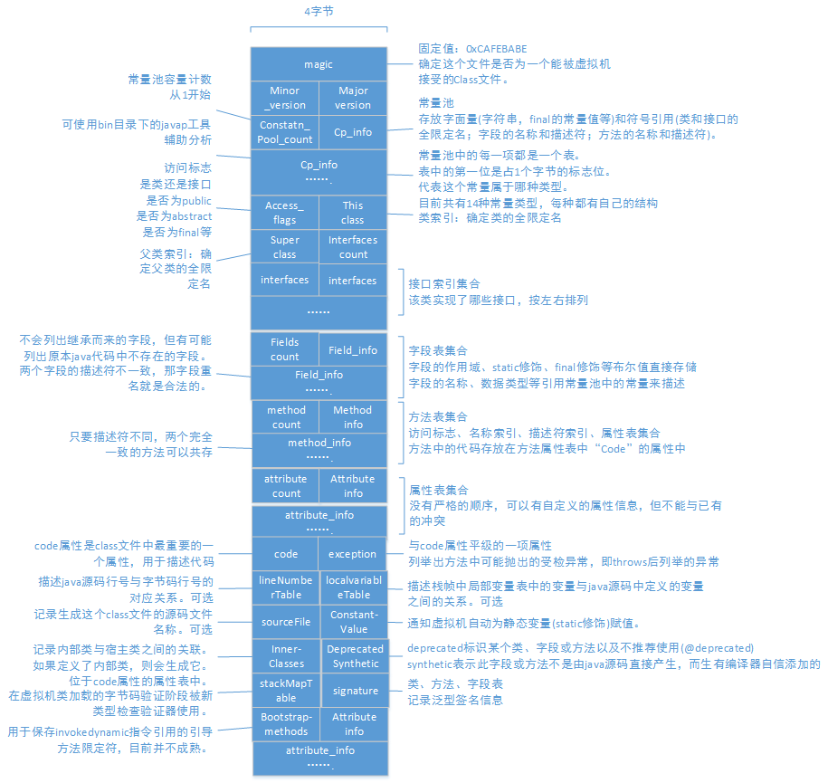

# 类文件结构
## 无关系的基石
java诞生之初，便有“一次编写，到处运行”的口号。而实现这一口号的便是现今各大虚拟机提供商所发布的可以运行在各个不同平台上的虚拟机。
各种不同平台的虚拟机与所有平台都统一使用的程序存储格式-字节码-是构成平台无关性的基石，也是实现语言无关性的基础。
**java虚拟机不和包括java在内的任何语言绑定，只与“Class文件”这种特定的二进制文件格式所关联，该文件中包含了java虚拟机指令集和符号表以及若干其它辅助信息。**
java语言中的各种变量、关键字和运算符号的语义最终都是由多条字节码命令组合而成的。--》字节码命令所能提供的语义描述能力肯定会比Java语言本身更加强大。--》为其它语言实现一些有别于Java的语言特性提供了基础。
## Class类文件的结构
Class文件是一组以8位字节为基础单位的二进制流，各个数据项目严格按照顺序紧凑地排列在Class文件之中，中间没有添加任何分隔符。当遇到需要占用8位字节以上空间的数据项时，则会按照高位在前的方式分割成若干个8位字节进行存储。
Class文件格式采用一种类似C语言结构体的伪结构来存储数据，这种伪结构中只有两种数据类型：**无符号数和表**。
无符号数属于基本的数据类型，以u1,u2,u4,u8分别代表1个字节、2个字节、4个字节和8个字节的无符号数。无符号数可以**用来描述数字、索引引用、数量值或按照UTF-8编码的字符串值。**
表是**由多个无符号数或其它表 作为数据项构成的符合数据类型。**所有表都习惯性的以“_info”结尾。表**用于描述有层次关系的复合结构的数据，整个Class文件本质上就是一张表。**

## 字节码指令简介
java虚拟机的指令**由一个字节长度的操作码以及跟随其后的零至多个操作数而构成**。大多数指令都不包含操作数，只有一个操作码。
字节码指令集是一种具有鲜明特点、优劣势都很突出的指令集架构：
- 由于限制了Java虚拟机操作码的长度为一个字节(0~255)，意味着指令集的操作码重视不可能超过256条
- Class文件放弃了编译后代码的操作数长度对其，意味着虚拟机处理那些超过一个字节数据的时候，不得不在运行时从字节中重建具体数据的结构。固然会损失性能，但却缩小了代码体积。

下面是一个最简单的执行模型
```
do{
	寄存器值+1；
	根据寄存器的指示位置，从字节码流中取出操作码；
	if（字节码存在操作数） 从字节码中取出操作数；
	执行操作码所定义的操作
}while(字节码流长度>0)
```
### 字节码与数据类型
`iloda` i表示为int类型 load为指令动作，表示加载数据。这条字节码的意思便是：从局部变量表中加载int型的数据到操作数栈中。
需要注意的是，每种指令所支持的数据类型的有所不同。详情请[查阅相关java虚拟机规范]()
具体的指令集分类和介绍推荐参考[博文](http://www.cnblogs.com/gnivor/p/4521878.html)