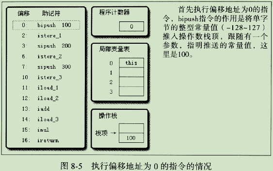

# 虚拟机字节码执行引擎
输入字节码文件，解析字节码，输出执行结果。
## 运行时栈帧结构
一个栈帧包括了局部变量表、操作数栈、动态连接、方法返回地址等。在编译代码的时候，局部变量表、操作数栈的大小都已完全确定，并写入到方法表的code属性之中。因此，一个栈帧需要分配多少内存，不会受到程序运行期变量数据的影响。
位于栈顶的栈帧称为*当前栈帧*，与这个栈帧相关联的方法称为*当前方法*。

### 局部变量表
局部变量表**是一组变量值存储空间，用于存放方法参数和方法内部定义的局部变量。**
以**变量槽(Slot)**为最小单位。允许Slot的长度可以随处理器、操作系统或虚拟机的不同而发生变化。一个Slot可以存放一个32位以内的数据类型，有`boolean,byte,char,short,int,float,reference和returnAddress`8种。java语言中明确的64位的数据类型只有`long`和`double`两种，采用分割存储法。**由于局部变量表建立在线程的堆栈上，是线程私有的数据，无论是否为原子操作，都不会引起数据安全问题。**
虚拟机通过索引定位的方式使用局部变量表，值从0~最大Slot数量。在方法执行时，虚拟机使用局部变量表完成参数值到参数变量列表的传递过程。如果执行的是实例方法(非static方法)，那第0位索引的Slot默认是用于传递方法所属对象实例的引用，即`this`关键字。参数表分配完毕后，再根据方法体内部定义的变量顺序和作用域分配其余的Slot。
为了尽可能的节省栈空间，局部变量表中的Slot是可以重用的，**方法体中定义的变量，其作用域并不一定会覆盖整个方法体**，如果当前字节码PC计数器的值已经超出了某个变量的作用域，那这个变量对应的Slot就可以交给其他变量使用。
局部变量不像类变量那样存在两次赋值。**如果一个局部变量定义了但没有赋初始值是不能使用的。**
### 操作数栈
它是一个后入先出(LIFO)栈,它的最大深度也在编译的时候写入到Code属性的max_stacks数据项中。操作数栈的每一个元素可以是任意的java数据类型。在方法执行的任何时候，操作数栈的深度都不会超哥哥max_stacks。
当一个方法刚开始执行时，这个方法的操作数栈是空的，在方法执行的过程中，会有各种字节码指令往操作数栈中写入和提取内容，即出栈/入栈操作。
在概念模型中，两个栈帧作为虚拟机栈的元素是完全相互独立的。但在实现上都会令两个栈帧出现一部分重叠。

### 动态连接
每个栈帧都包含一个指向运行时常量池中该栈帧所属方法的引用，持有这个引用是为了支持方法调用过程中的动态连接。Class文件的常量池中存有大量的符号引用，字节码中的方法调用指令就以常量池中指向方法的符号引用作为参数。这些符号引用一部分会在类加载阶段或第一次使用的时候就转化为直接引用，称为[静态解析](#静态解析)。另一部分将在每次运行期间转化为直接引用，称为[动态连接](#动态连接)
### 方法返回地址
当一个方法开始执行后，只有两种方式可以退出这个方法。
1. 执行引擎遇到任意一个方法返回的字节码指令，是否有返回值和返回值的类型将根据遇到何种方法返回指令来决定，这种退出方法称为*正常完成出口*。方法退出时，调用者的pc计数器的值可以作为返回地址。
2. 在方法执行过程中遇到了异常，并且这个异常没有在方法体内得到处理。这种退出方式称为*异常完成出口*，不会给上层调用者产生任何返回值。返回地址通过异常处理器表来确定。

无论采用何种退出方式，在方法退出后，都需要返回到方法被调用的位置，程序才能继续执行。方法退出的过程实际上就等同于吧当前栈帧出栈，因此退出时可能执行的操作有：恢复上层方法的局部变量表和操作数栈，把返回值压入调用者栈帧的操作数栈中，调整PC计数器的值以指向方法调用的后一条指令等。
##　方法调用
方法调用并不等同于方法执行，调用阶段唯一的任务是**确定被调用方法的版本(调用哪一个方法)**，暂时还不涉及方法内部的具体运行工程。Java方法调用过程需要在类加载期间，甚至是运行期间才能确定目标方法的直接引用。
### 解析<a name="静态解析"></a>
所有方法调用中的目标方法在Class文件里面都是一个常量池中的符号引用，在类加载的解析阶段，会将其中的一部分符号引用转化为直接引用。这种解析成立的前提是：方法在程序正在运行之前就有一个可确定的调用版本，并且这个版本在运行期是不可变的。即**调用目标在程序代码写好、编译器进行编译时就必须确定下来。**
在Java语言中，符合“编译期可知，运行期不可变”这个要求的方法，主要包括静态方法和私有方法两大类。前者与类型直接关联，后者在外部不可被访问，他们的特点决定了它们都不可能通过继承或别的方式重写其他版本，因此都适合在类加载阶段进行解析。
与之相对应的，Java虚拟机提供了5条方法调用字节码指令：
- invokestatic:调用静态方法。
- inovkespecial:调用实例构造器`<init>`方法、私有方法和父类方法。
- invokevirtual:调用所有的虚方法。
- invokeinterface:调用接口方法，会在运行时再确定一个实现此接口的对象。
- invokedynamic:先在运行时动态解析出调用点限定符所引用的方法，然后再执行该方法。

只要能被invokestatic和invokespecial指令调用的方法，都可以在解析阶段中确定唯一的调用版本，符合这个条件的有静态方法、私有方法、实例构造器、父类方法4类，这些方法可以称为*非虚方法*，与之相反，其它方法称为*虚方法*(除final方法)。
`final`方法无法被覆盖，没有其他版本，因此也无需对方法接受者进行多态选择，或者说多态选择的结果肯定是唯一的。明确说明了final方法时一种非虚方法。
### 分派
#### 静态分派
`Hunam man = new Man()`
上述代码，我们将等号左边的“Human”称为变量的**静态类型**，等号右边的“Man”则称为变量的**实际类型**。
静态类型和实际类型在程序中都可以发生一些变化，区别是静态类型的变化仅仅在使用时发生，变量本身的静态类型不会被改变，并且最终的静态类型是在编译期可知的；而实际类型变化的结果在运行期才可确定。
```
//实际类型变化
Human man = new Man();
man = new Woman();
//静态类型变化
(Man)man;
(Wonam)man;
```
**虚拟机在重载时是通过参数的静态类型作为判断依据的**并且静态类型是编译期可知的
所有依赖静态类型来定位方法执行版本的分配动作称为静态分配。静态分配的典型应用是==方法重载==
#### 动态分派<a name="动态分派"></a>
invokevirtual指令的解析过程如下，这个过程就是Java语言中方法**重写**的本质。这种在运行期根据实际类型确定方法执行版本的分派过程称为动态分派。

**当重载和重写同时出现时，先执行重载确定要调用父方法签名，再执行重写确定调用哪个类(父类还是子类)的该方法**
## 基于栈的字节码解释执行引擎
### 解释执行
只有确定了谈论对象是某种具体的java实现版本和执行引擎运行模式时，谈解释执行还是编译执行才会比较确切。
Java语言中，javac编译器完成了程序代码经过词法分析、语法分析到抽象语法树，再遍历语法树生成线性的字节码指令流的过程。因为这一部分动作是在Java虚拟机之外进行的，而解释器在虚拟机的内部，所以Java程序的编译就是**半独立的实现**。
### 基于栈的指令集与基于寄存器的指令集
Java编译器输出的指令流，基本上是一种基于栈的指令集架构：指令流中的指令大部分都是零地址指令，它们依赖操作数栈进行工作。
而我们先进主流的PC机中直接指出的指令集架构，便是基于寄存器的指令集：这些指令依赖寄存器进行工作。
基于栈的指令集主要优点就是**可移植**，寄存器由硬件直接提供，程序直接依赖这些硬件寄存器则不可避免地要受到硬件的约束。主要缺点是执行速度相对来说会稍慢一些。
### 基于栈的解释器执行过程
下面，就用一个四则运算的例子，来说明一下在虚拟机中实际是如何执行的。
代码：
```
public int caic(){
	int a = 100;
	int b = 200;
	int c = 300;
	return (a+b)*c;
}
```
字节码：

执行过程：



