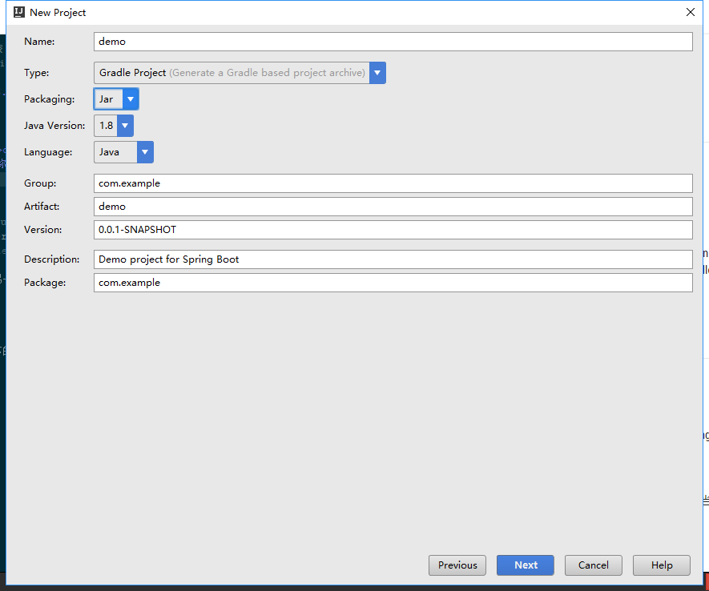

#Spring boot 之旅
##使用IDEA新建spring boot工程
- 前期准备：
	1. idea 2016.2.4+
	2. grandle
	3. JRE
- 创建步骤
	1. 打开idea->create new project,左侧选择spring Initializr,进入下一步
	2. 填写工程名称(name)，选择类型(type)为Gradle Project->next
	3. 勾选需要使用的功能组件，这里我们只需要一个 Web，->next
	4. 填写项目信息,->next 然后等待idea创建项目(最好有大水管的vpn)
	5. 创建好项目之后，勾选自动更新(Use auto-import) 和使用默认的gradle wrapper
	6. 创建好的项目目录结构如下
	7. 运行DemoApplication,即可启动spring boot和它内置的tomcat.详见[错误记录](#error)

##spring boot 显示页面
- [配置](#error1)
	1. bulid.grandle中需要添加插件`apply plugin: 'war'`
	 一定要两个依赖库
	`compile('org.springframework.boot:spring-boot-starter-web')`
	`compile("org.apache.tomcat.embed:tomcat-embed-jasper:8.0.20")`
	 如果模板页是jsp，那么也需要如下两个依赖库
	`compile("javax.servlet:javax.servlet-api:3.1.0")`
	`compile("javax.servlet:jstl:1.2"){transitive = false}`
	2. application.properties
	`spring.view.prefix=/WEB-INF/jsp/`
	`spring.view.suffix= .jsp`

- 使用
	1. 创建一个jsp页面
```
<%@ page contentType="text/html;charset=UTF-8" language="java" %>
<html>
  <head>
    <title>Welcome</title>
  </head>
  <body>
    hello ${name}
  </body>
</html>
```
	2. 创建一个controller，代码如下
```
@Controller
public class HelloController {
    @RequestMapping("/hello")
    public ModelAndView helloWorld(@RequestParam(required = false,defaultValue = "world") String name){
        ModelAndView modelAndView = new ModelAndView();
        modelAndView.setViewName("index");
        modelAndView.addObject("name",name);
        return modelAndView;
    }
}
```
	3. 启动spring boot,在浏览器中输入`http://localhost:8080/hello`，将会看到输出了hello world

##spring boot 配置

##错误记录
###java.lang.NoSuchMethodError:<span id="error"></span>
javax.servlet.ServletContext.getContextPath()Ljava/lang/String;
**原因**:与`servlet-api.jar`的版本有关。
1. 版本过低
2. 当前工程中存在另一个`servlet-api.jar`包，而当前的jre中`./lib/ext`或`./lib`下也存在该包

**解决**:
1. 用新版本的替换
2. 删除某一个路径下的该jar包，或取消对其的依赖

###AbstractMethodError:<span id="error1"></span>
** 原因**：jar包冲突
** 解决**：将`bulid.grandle`中的spring boot插件改为`apply plugin: 'spring-boot'`
###页面显示error page 提示未找到路径

** 原因**:
1.配置文件配置不正确
2.文件的存放路径不正确
** 解决**:
1.注意语法，与spring boot的版本有关
2.如果引入了`spring-boot-starter-web`，则默认路径在`src/main/webapp`下；未引入则在`src/main/resources/templates`下。可以在配置文件中手动更改
